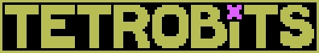

# TETROBITS

TETROBITS is a Tetris-inspired game built with React, Vite, Tailwind CSS, and the Canvas API. It features the classic Tetris mechanics alongside a leveling system and a custom currency called BITS, which you can spend to play a new challenging game mode.

## Installation

1. Ensure you have Node.js and npm installed.
2. Clone this repository

```bash
git clone https://github.com/soringavra/tetrobits.git
cd tetrobits
```

3. Install dependencies

```bash
npm install
```

4. Start the dev server

```bash
npm run dev
```

## Demo

https://snazzy-crostata-444ed0.netlify.app/

## Contributing

Contributions are always welcome! If you think you can improve this project, feel free to open an issue or submit a pull request.

## Credits

- Music composed by David Renda
- Sound effects generated with [JSFXR](https://sfxr.me)
- Pixel font by [Patrick Adams (thewolfbunny64)](https://thewolfbunny64.itch.io/)

## License

This project is open source for educational and reference purposes only.

You are free to:

- Clone and study the code
- Submit pull requests to improve the project

You are not allowed to:

- Redistribute or republish the project or any part of it
- Use the code, assets, or design commercially
- Upload modified or unmodified versions elsewhere

© 2026 Sorin Gavra. All sprites and code are my own.
